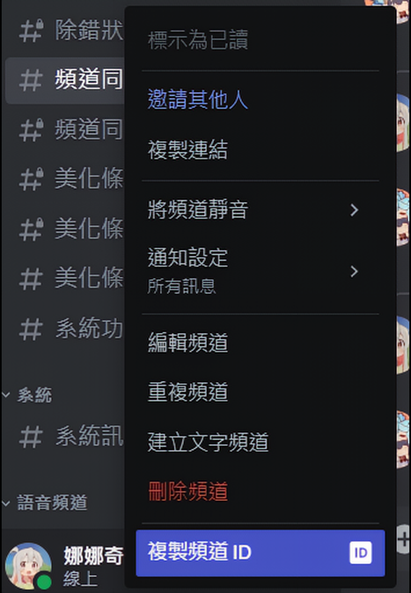
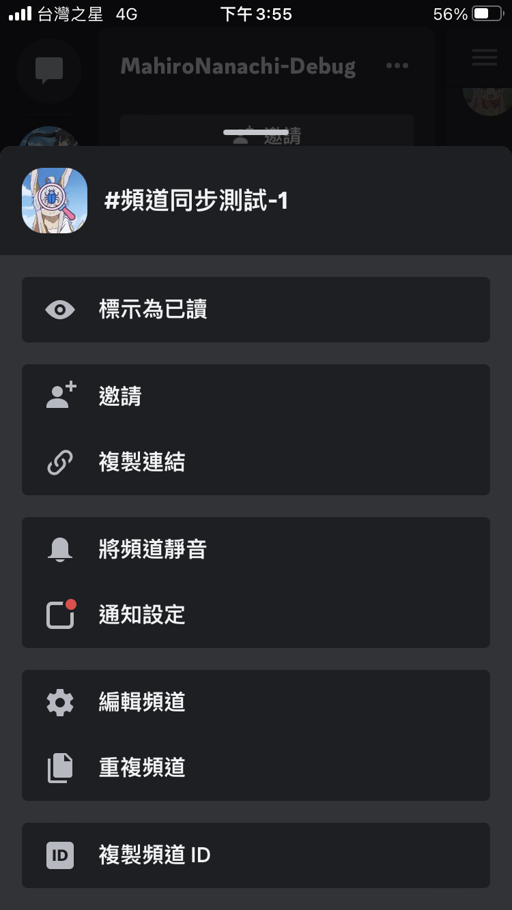

[](https://nodejs.org/)
[](https://github.com/a2569875/sd-webui-prompt-highlight/blob/main/LICENSE)
# Discord-Telegram-Bot

這個機器人的功能是在多個群組間傳話的機器人，包括但不限於Discord、Telegram等通訊軟體。啟發自[中文維基百科互連群](https://zh.wikipedia.org/wiki/Wikipedia:%E4%B8%AD%E6%96%87%E7%B6%AD%E5%9F%BA%E7%99%BE%E7%A7%91%E5%BF%97%E9%A1%98%E8%80%85%E4%BA%92%E8%81%AF%E4%BA%A4%E6%B5%81%E7%BE%A4)中的[zhmrtbot](User:Renamed_user_9811840658/zhmrtbot)。

這個專案修改自[LilyWhiteBot](https://github.com/mrhso/LilyWhiteBot/tree/master)，原名為「[qq-tg-irc](https://github.com/esons/qq-tg-irc)」。

[原版的Readme](README-old.md)

本專案開發是基於Fork，基於上游專案的定義，其還支援Discord、Telegram、微信\(WeChat\)、IRC、QQ等通訊軟體間的訊息同步功能。但本專案僅以Discord和Telegram間的訊息同步開發維護。

### Language
* [繁體中文](README.zh-hant.md)
* [English](README.md)

## 如何安裝

### 必需步驟
* 根據實際需要準備機器人賬號。（具體方法見後面）
* 安裝 Node.js，版本要求：>=7.x。
* 下載機器人本體。
* 執行：
```
npm install
node main.js
```
* 如果擔心 crash 的話請直接迴圈，例如 `while true; do node main.js; done`，或者：
```batch
:a
node main.js
goto a
```
* 根據實際需要修改 config.example.js，並改名為 config.js。
* QQ 群格式 `qq/QQ 群號`；Telegram 群格式 `telegram/一串數字`（該數字可透過`/thisgroupid`取得，後面有說明，而且請注意該數字是**負數**）；IRC 頻道格式 `irc/#頻道名`，別忘了`#`；Discord 頻道格式 `discord/頻道 ID`。

### 設定 Telegram 機器人
在Telegram中找到用戶[@BotFather](https://t.me/BotFather)，與其交互，按照畫面上的提示進行操作，建立一個機器人賬號。設定完成後，BotFather 會給一個 Token，你需要把這個 Token 填到 config.js 中。

之後請記得執行 `/setprivacy` 命令，將機器人的 Privacy 設為 DISABLED，以便於讓它看到群組內的訊息。

在剛開始的時候，可以保留 config.js 之內「plugins」中的「groupid-tg」，然後執行程式，並且在群組中輸入 `/thisgroupid`，這樣機器人會自動給出群組 ID 以便設定互聯。如果沒看懂前面那句話，你也可以把 [@combot](https://t.me/combot) 拉進群中，然後輸入 `/stat`，看機器人給出的數字是多少。注意，數字是負數。

### 設定 Discord 機器人
進入 [Discord Developer Portal](https://discordapp.com/developers/applications/)，創建 Application。在 Bot 頁面中 Add Bot。將 Token 填到 config.js 中。可參考[這篇教學](https://hackmd.io/@smallshawn95/python_discord_bot_base)的前半部分。

頻道 ID 可以在網頁版之 URL 看到，最後面的那串神祕數字便是。

也可以在電腦版的頻道上按右鍵，點選\[複製頻道ID\]來獲得。手機也可以藉由長按頻道來獲得對應選單。
|   電腦版  |  手機板  |
|   ----    |  ----   |
|  |  |

### 設定 其他平台機器人
請[參考舊版ReadMe](README-old.md)
- [設定QQ機器人](README-old.md#設定-qq-機器人)
- [設定IRC機器人](README-old.md#設定-irc-機器人)
- 設定WeChat機器人
   * 在 config.js 裡加入 `"WeChat": { ... }`，並按照[QQ設定](README-old.md#設定-qq-機器人)

## 提示
1. 如果把 config.js 中的 `paeeye` 設為 `//`，那麼在訊息之前加入 `//`（例如「//隱藏」）可防止被其他群組看見。
2. 如果允許 IRC 接受命令（plugins 中有「irccommand」），那麼可在 Telegram 和 QQ 中使用 `/command 命令`。該命令並非 IRC 命令，而是為配合 IRC 頻道中的機器人而設。
3. 如果允許查詢 IRC 的情況（plugins 中有「ircquery」），那麼可在 Telegram 和 QQ 中使用 `/names`（取得在線用戶清單）、`/whois 暱稱`（whois）和 `/topic`（取得 Topic）。

### 其他功能
以下各功能的設定方法均為改 config.js。
* [filter](https://github.com/vjudge1/LilyWhiteBot/blob/master/plugins/filter.js)：過濾符合指定規則的訊息。
* [qqxiaoice](https://github.com/vjudge1/LilyWhiteBot/blob/master/plugins/qqxiaoice.js)：召喚 QQ 群的小冰。（需要 QQ 群群主開啟小冰/BabyQ 功能）
* [wikilinky](https://github.com/vjudge1/LilyWhiteBot/blob/master/plugins/wikilinky.js)

## 銘謝
*  [zhmrtbot原始作者mrhso](https://github.com/mrhso)、[qq-tg-irc原始作者esons](https://github.com/esons)、[LilyWhiteBot](https://github.com/mrhso/LilyWhiteBot/tree/master)、[qq-tg-irc](https://github.com/esons/qq-tg-irc)
*  [JackEllie的Stable-Siffusion的社群團隊](https://discord.gg/TM5d89YNwA) 、 [Youtube頻道](https://www.youtube.com/@JackEllie)
*  [中文維基百科的社群團隊](https://discord.gg/77n7vnu)

<p align="center"></p>
